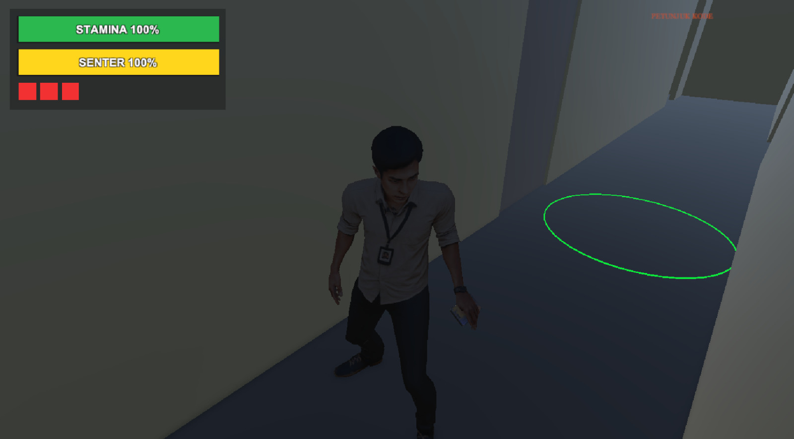
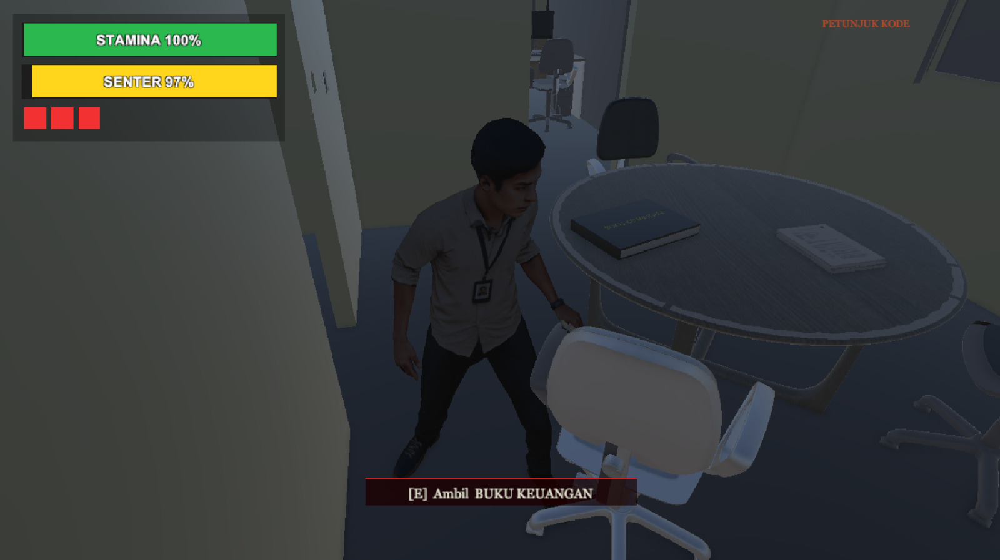
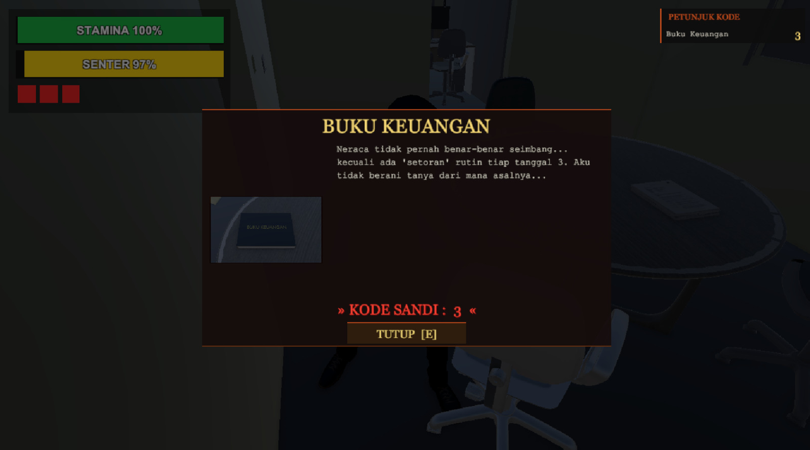
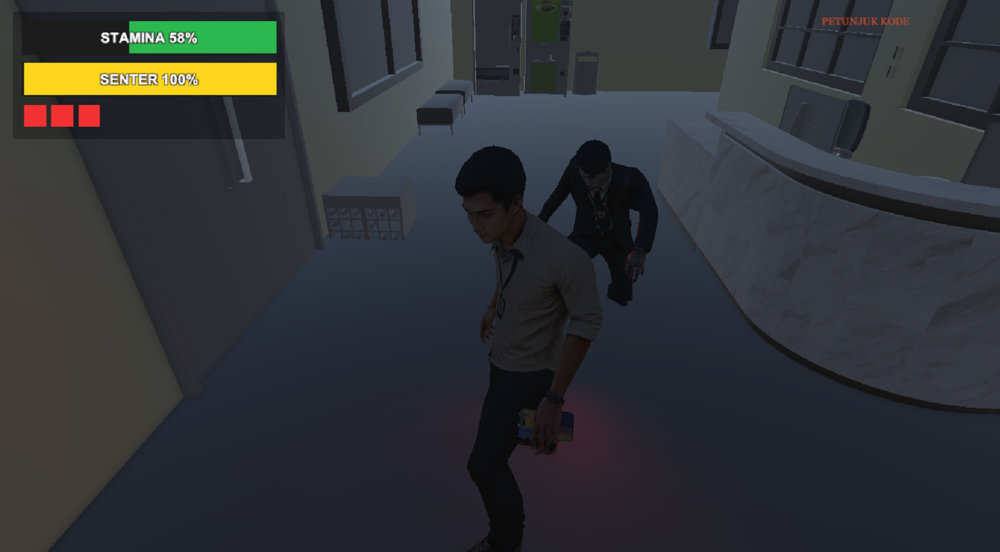
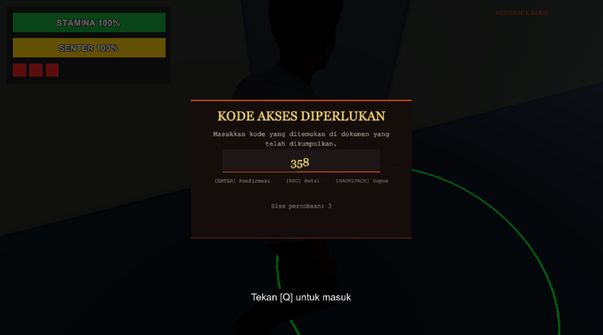
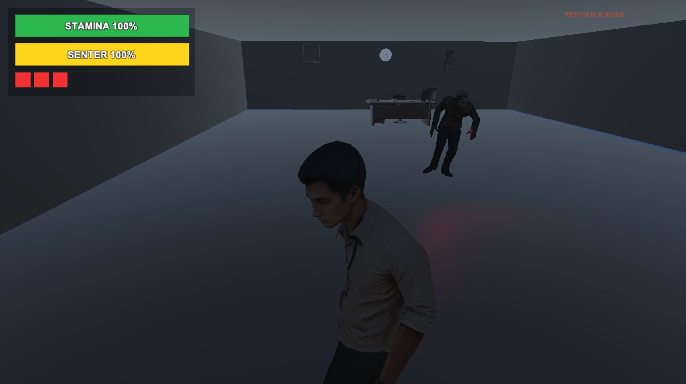

# Unity3D-LemburMaut

Lembut Maut adalah game horor survival 3D berbasis Unity dengan tema eksplorasi gedung bertingkat, penyelesaian objektif, penghindaran musuh, dan rangkaian cutscene cerita.

## Tentang Game

Di game ini, pemain harus bertahan hidup sambil menjelajahi tiap lantai, mencari item penting, membuka akses ke area berikutnya, dan menghindari ancaman NPC/Boss yang patroli.

Nuansa permainan dibangun lewat:
- Atmosfer gelap dan tegang
- Tata suara ambien dan efek kejutan
- Cutscene intro/ending
- Sistem progres antar lantai

## Fitur Utama

- Movement karakter third-person
- Sistem kamera gameplay
- Interaksi item dan collectible
- Sistem senter dan stun (flashlight stun)
- NPC AI dengan patrol/chase behavior
- Encounter Boss per area tertentu
- Trigger area, trap, dan portal progres
- HUD runtime player
- Main menu dengan efek visual glitch
- Cutscene video (intro, floor intro, ending)

## Teknologi

- Engine: Unity
- Bahasa scripting: C#
- Paket Unity utama: URP, Input System, NavMesh, TextMesh Pro

## Struktur Proyek (Ringkas)

- Assets/
  - Scenes/ : Seluruh scene gameplay, menu, dan ending
  - script/ : Script gameplay inti (controller, UI, AI, trigger)
  - Settings/ : Konfigurasi render pipeline dan profile
  - TextMesh Pro/ : Asset TMP
- Packages/ : Dependency package Unity
- ProjectSettings/ : Konfigurasi project Unity

## Cara Menjalankan Proyek

1. Install Unity Hub.
2. Gunakan versi Unity yang sesuai dengan proyek (cek di ProjectSettings/ProjectVersion.txt).
3. Buka folder proyek ini melalui Unity Hub.
4. Tunggu proses import asset selesai.
5. Jalankan scene awal dari folder Scenes (misalnya Main Menu) lalu klik Play.

## Screenshot Gameplay

### Main Menu

### Gameplay

### Game Over

## Kontrol Dasar (Dapat Berubah Sesuai Build)

- Gerak: WASD
- Kamera: Mouse
- Aksi/interaksi: sesuai binding Input System di proyek

Catatan: Mapping kontrol dapat berubah tergantung setting terbaru pada input action.

## Kontribusi

Kontribusi perbaikan diperbolehkan melalui issue atau pull request.

## Developer

Game ini dibangun secara penuh di Unity (coding, implementasi gameplay, dan pengembangan) oleh **Anugrah (nugrahn0123)** sebagai developer utama

Perancang assets game: **Nur Qamariyah Yunus** dan **Nur Aliyah Amaliani**.

## Lisensi

Belum ada lisensi khusus yang ditetapkan. Jika ingin penggunaan ulang aset/kode, mohon hubungi developer terlebih dahulu.
